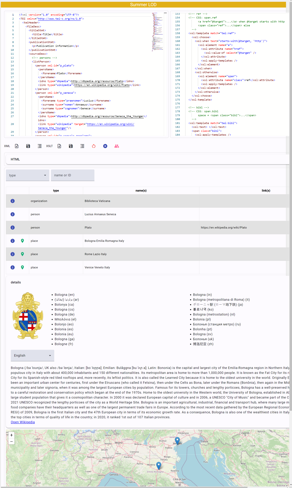

# Summer LOD App

This project was generated with [Angular CLI](https://github.com/angular/angular-cli) version 17.2.2.

## Docker

🐋 Quick Docker image build:

1. update version in `env.js` (and in Docker compose file), then `ng build`;
2. `docker build . -t vedph2020/summer-lod-app:0.0.2 -t vedph2020/summer-lod-app:latest` (replace with the current version).
3. push:

```bash
docker push vedph2020/summer-lod-app:0.0.2
docker push vedph2020/summer-lod-app:latest
```

## Overview

This toy application has been created for a workflow like this:

1. start from a TEI text.
2. add an XSLT transformation to render TEI into HTML.
3. extract entities from TEI, enriching them with data from the LOD.

This workflow can be useful to show how all these technologies work together in a real-world scenario, even though the toy application is minimalist and so are the sample documents handled by it.

The UI relies on a [backend API](https://github.com/vedph/summer-lod-api) for processing XML, and provides:

- a code panel for XML.
- a code panel for XSLT.
- a toolbar allowing you to load/save files, prettify XML, transform XML, extract entities from XML.
- a list of extracted entities.
- the details about any of the extracted entities, as drawn from DBPedia/Wikidata.
- for places, their location on a map. The location too is derived from DBPedia/Wikidata.

## Notes

- ⚠️ Before switching to Leaflet, updating MapboxGL required to apply patch for this [MapboxGL issue](https://github.com/Wykks/ngx-mapbox-gl/issues/410)
- [DBPedia lookup](https://lookup.dbpedia.org/index.html)
- [WikiData lookup](https://query.wikidata.org/)

## Screenshot

This screenshot was taken from the current alpha version of the app:


